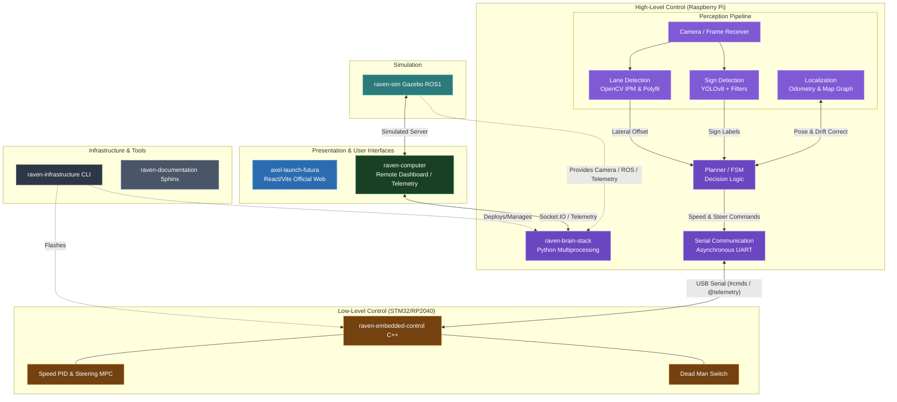

# RAVEN - Embedded Control ("The Spinal Cord")

 

The **Embedded Control** firmware runs on the **STM32 Nucleo** board. It provides low-level hardware abstraction, real-time motor control, and safety features.

## 🌍 Global System Architecture



## 📚 Documentation
> **Full Technical Documentation:** [bosch-future-mobility-challenge-documentation.readthedocs-hosted.com](https://bosch-future-mobility-challenge-documentation.readthedocs-hosted.com)

---

## 🚀 Key Features

| Task ID | Feature Name | Description |
| :--- | :--- | :--- |
| **[003a]** | **Speed PID Controller** | Closed-loop velocity control using IMU feedback and dynamic gain tuning. |
| **[003b]** | **Steering & MPC** | Servo control with anti-jitter and Model Predictive Control command support. |
| **[004a]** | **Message Lexer** | Efficient parsing of incoming serial packets (e.g., `#SPEED:15.5;;`). |
| **[004b]** | **Command Parser** | Routes parsed commands to appropriate subsystems (Motors, Sensors). |
| **[004c]** | **Dead Man's Switch** | Safety watchdog that stops the car if the Brain disconnects (>500ms). |

## 🛠️ Usage

### Flashing
Use Mbed Studio or CLI to compile and flash:
```bash
mbed compile -t GCC_ARM -m NUCLEO_F401RE --flash
```


### Serial Commands
Connect via USB (Baud: 115200) to send manual commands:
- `#speed:20.0;;` (Set speed to 20 cm/s)
- `#steer:15.0;;` (Set steer angle to 15 deg)
- `#brake:1;;` (Emergency Stop)

---

## ⚡ Arduino Nano RP2040 Connect (New)

We now support the Arduino Nano RP2040 Connect as an alternative to the Nucleo.

### Pinout (RP2040 Connect)
- **Wheel Encoders**:
  - `CLK`: Pin 2 (Hardware Interrupt)
  - `DT`: Pin 3
- **Speed Motor (L298N)**:
  - `IN1`: Pin 7
  - `IN2`: Pin 8
  - `EN`: Pin 9 (PWM)
- **Steering Servo**:
  - `Signal`: Pin 11
- **IMU**: Built-in LSM6DSOX

### Flashing (Arduino-CLI)
Use the `raven` CLI to flash the Arduino firmware:
```bash
raven flash --arch arduino
```